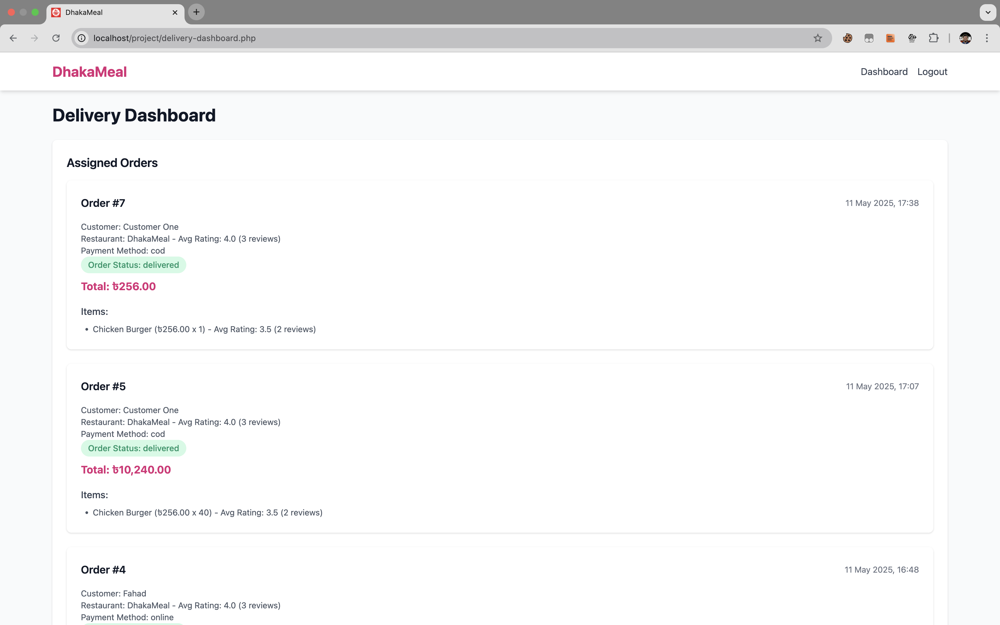

#DhakaMeal
A food delivery web application built with PHP, MySQL, and Tailwind CSS.
Features

User authentication for customers, delivery personnel, and restaurants.
Order management with cart, order history, and review system.
Restaurant stock management and order acceptance.
Profile management with image upload and address updates.
Responsive design for desktop and mobile.

Example Login Credentials

Customer: Email: customer@example.com, Password: password123
Restaurant: Email: restaurant@example.com, Password: password123
Delivery Person: Email: delivery@example.com, Password: password123(Note: These are example credentials. Update the database with your own users or reset passwords as needed.)

Installation

Clone the repository: git clone https://github.com/your-username/DhakaMeal.git
Set up a MySQL database and update config/database.php with your credentials.
Import the provided SQL schema (if available) to create tables.
Start a local server (e.g., XAMPP, MAMP) and access via http://localhost/DhakaMeal.

Usage

Log in as a customer to order food, view cart, and manage profile.
Log in as a restaurant to manage orders and update stock.
Log in as a delivery person to view assigned orders.
Navigate via the header menu to access profiles, dashboards, and other pages.

Technologies

Backend: PHP, MySQL
Frontend: HTML, Tailwind CSS
Other: JavaScript for dynamic features

Contributing
Feel free to submit issues or pull requests. Please follow the existing code style.
License
MIT License (or specify your preferred license)
Screenshots
Consider adding screenshots to showcase the application:

Home page with restaurant listings.
Cart page with items and checkout.
Profile page with editable fields and image upload.
Restaurant dashboard with order management. To add, place images in a screenshots/ folder and link them like:

